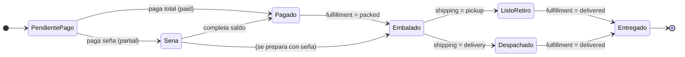
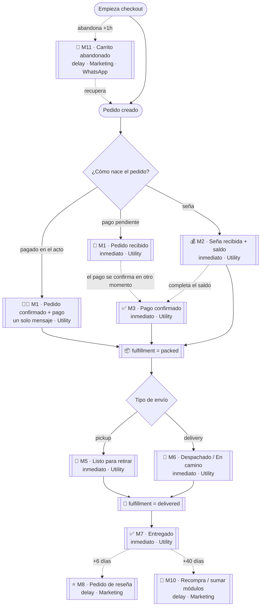

# Flujos de mensajes transaccionales — Tubular

> Mensajes **transaccionales / utility** disparados por eventos del pedido.
> Canal principal: **WhatsApp** (cuando esté la API oficial verificada). Mientras tanto,
> los mismos disparadores pueden salir por **email**. Nada de esto es promo masiva.

## Principios

1. **Un mensaje por evento.** Cada mensaje se dispara por una transición de estado concreta y se registra para **no reenviarse** (idempotencia por `order_id + tipo`).
   - **Pedido + pago juntos = un solo mensaje.** Si el pedido nace ya pagado (todo en el mismo momento), se manda **solo M1** (confirmando pedido + pago). El mensaje de pago (M3) **solo** sale si el pago se confirma en un momento distinto al alta del pedido.
2. **Ventana horaria:** enviar solo entre **9:00 y 21:00 (ART)**. Fuera de ese rango, encolar para la mañana.
3. **Opt-out:** todo mensaje permite responder `BAJA` para dejar de recibir.
4. **Categorías de WhatsApp:** los `Utility` se disparan por el evento del pedido (permitidos fuera de la ventana de 24h con plantilla aprobada). Los `Marketing` (reseña, recompra) requieren opt-in y plantilla marketing.
5. **Datos siempre presentes en el pedido:** nombre, nº de pedido, items, total, saldo, tipo de envío, dirección/tracking.

---

## 1) Ciclo de vida del pedido



---

## 2) Mapa maestro de mensajes (evento → mensaje)



---

## 3) Timeline post-entrega

```mermaid
gantt
    title Después de "Entregado"
    dateFormat  D
    axisFormat  Día %d
    section Post-venta
    Entregado (M7)        :milestone, 0, 0d
    Pedido de reseña (M8) :milestone, 6, 0d
    Recompra / módulos (M10) :milestone, 40, 0d
```



---

## 4) Especificación de cada mensaje

| ID | Mensaje | Disparador (estado real) | Timing | Categoría WA | Canal |
|----|---------|--------------------------|--------|--------------|-------|
| M11 | Carrito abandonado | inicia checkout y no compra | +1h (y opcional +24h) | Marketing | **WA** |
| M1 | Pedido confirmado | `order.created` — **incluye el pago si nace pagado** | inmediato | Utility | WA + email |
| M2 | Seña recibida + saldo | `status = partial` al crear | inmediato | Utility | WA |
| M3 | Pago confirmado | `status → paid` **solo si el pago se acredita en otro momento** que el alta | inmediato | Utility | WA |
| M5 | Listo para retirar | `fulfillment → packed` **y** `pickup` | inmediato | Utility | WA |
| M6 | Despachado / en camino | `fulfillment → packed` **y** `delivery` | inmediato | Utility | WA |
| M7 | Entregado | `fulfillment → delivered` | inmediato | Utility | WA |
| M8 | Pedido de reseña | `delivered` + 6 días | delay | Marketing | WA |
| M10 | Recompra / sumar módulos | `delivered` + 40 días | delay | Marketing | WA |

> **Notas:**
> - **Pedido + pago simultáneos = un solo mensaje (M1).** M3 solo sale si el pago llega en un momento distinto al alta del pedido.
> - No hay un "M4 embalado" genérico a propósito — al pasar a `packed` el sistema ramifica directo a **M5 (retiro)** o **M6 (envío)** para no mandar dos mensajes seguidos.
> - **M11 (carrito abandonado) requiere capturar el WhatsApp al inicio del checkout** (ver sección 7). Hoy la recuperación existente es por **email**; se migra/complementa a WhatsApp.

---

## 5) Copy propuesta (ES-AR)

Variables entre `{{ }}` = se completan desde el pedido.

**M11 · Carrito abandonado** _(requiere WhatsApp capturado al inicio del checkout)_
```
¡Hola {{nombre}}! 👋 Vimos que quedaste a un paso de tu pedido en Tubular.
🛋️ {{resumen_items}} — ${{total}}
Te dejamos el carrito listo para terminar la compra 👉 {{link_recuperar}}
¿Alguna duda? Respondé este mensaje y te ayudamos.
```

**M1 · Pedido confirmado — variante "nace pagado"** _(pedido + pago en el mismo momento; NO se manda M3)_
```
¡Hola {{nombre}}! 👋 Recibimos tu pedido *#{{numero}}* y el *pago está confirmado* ✅
🛋️ {{resumen_items}}
Total pagado: ${{total}}
Ya arrancamos a prepararlo. Te avisamos en cada paso. ¡Gracias por elegirnos!
```

**M1 · Pedido confirmado — variante "pago pendiente"** _(luego llega M3 cuando se acredite)_
```
¡Hola {{nombre}}! 👋 Recibimos tu pedido *#{{numero}}* en Tubular.
🛋️ {{resumen_items}}
Total: ${{total}}
Te avisamos apenas se acredite el pago. ¡Gracias por elegirnos!
```

**M2 · Seña recibida + saldo**
```
¡Gracias {{nombre}}! 💰 Registramos tu seña de ${{sena}} para el pedido *#{{numero}}*.
Saldo pendiente: *${{saldo}}*.
Ya arrancamos a prepararlo. Cuando quieras completar el saldo, avisame.
```

**M3 · Pago confirmado**
```
¡Listo {{nombre}}! ✅ Confirmamos el pago total de tu pedido *#{{numero}}*.
Pasa a preparación 🛠️ — te aviso apenas esté embalado.
```

**M5 · Listo para retirar**
```
🎉 {{nombre}}, tu pedido *#{{numero}}* está *listo para retirar*.
📍 {{direccion_retiro}}
🕐 {{horarios}}
Traé tu DNI y el número de pedido. ¡Te esperamos!
```

**M6 · Despachado / en camino**
```
🚚 {{nombre}}, ¡tu pedido *#{{numero}}* salió para tu domicilio!
{{transporte_o_tracking}}
Cualquier cosa respondé este mensaje.
```

**M7 · Entregado**
```
✅ {{nombre}}, nos figura que tu pedido *#{{numero}}* fue entregado.
¡Esperamos que lo disfrutes! 🧡 ¿Salió todo bien? Escribinos si necesitás algo.
```

**M8 · Pedido de reseña**
```
¡Hola {{nombre}}! ¿Cómo venís con tu {{producto}} de Tubular? 🛋️
Tu opinión nos ayuda un montón ⭐ (1 minuto):
👉 {{link_resena}}
¡Gracias por bancar una marca que arma muebles a medida!
```

**M10 · Recompra / sumar módulos**
```
{{nombre}}, ¿sabías que tu mueble Tubular es *modular*? 🧩
Podés sumarle módulos y hacerlo crecer cuando quieras.
Mirá ideas 👉 {{link_configurador}}
```

---

## 6) Cómo se implementaría (para después)

1. **Tabla `message_log`** — `order_id`, `type` (M1…M10), `channel`, `status` (queued/sent/failed), `sent_at`. Garantiza idempotencia (índice único `order_id + type`).
2. **Disparadores inmediatos** — se enganchan en los puntos donde ya cambiamos estado: al crear pedido (sync/manual), al marcar seña/pagado, y al mover el kanban a `packed`/`delivered`. Ahí se encola el mensaje que corresponda.
3. **Disparadores con delay (M8, M10, M11)** — un cron cada X horas revisa lo que cumple condición (ej. `delivered` hace ≥6 días sin M8; checkout iniciado hace ≥1h sin pedido) y encola.
4. **Envío** — hoy stub / email; cuando esté la API de WhatsApp, el mismo `message_log` se despacha con las plantillas aprobadas (una plantilla WA por cada M).
5. **Ventana horaria + opt-out** se aplican en el dispatcher, no en cada disparador.

> Se puede construir el motor (tabla + log + cron) **ya**, enviando por email o dejándolo en
> "queued", y enchufar WhatsApp cuando Meta verifique el negocio. Cero retrabajo.

---

## 7) Carrito abandonado por WhatsApp (M11) — prerequisito

Hoy la recuperación de carrito existe **por email** (mu-plugin en `functions.php`). Para hacerla
por **WhatsApp** necesitamos el número **antes** de que la persona termine el checkout:

1. **Capturar el WhatsApp al inicio del checkout** — hoy el checkout pide email primero; hay que
   pedir (o priorizar) el **teléfono/WhatsApp** como campo temprano y guardarlo apenas se ingresa,
   junto al carrito, aunque no se complete la compra. Sin ese dato no hay a quién escribirle.
2. **Snapshot del carrito** (items + link de recuperación) asociado a ese número — ya lo tenemos
   para el email; se reutiliza.
3. **Disparo:** checkout iniciado hace ≥1h sin pedido creado → M11 (y opcional un segundo toque a +24h).
4. **Opt-in / legales:** al pedir el WhatsApp, dejar clara la casilla de "quiero recibir novedades y
   mi carrito por WhatsApp" (M11 es categoría **Marketing** → requiere consentimiento).

> **Orden sugerido:** primero sumamos el campo de WhatsApp al inicio del checkout + el guardado del
> snapshot (esto se puede hacer ya, sin la API). Cuando llegue la API oficial, se enchufa el envío.
